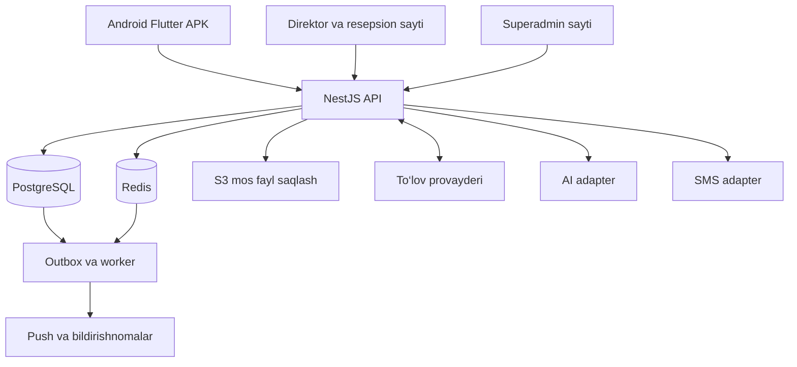

# Sihhat uz: talablar va arxitektura

Versiya: 1.0. Sana: 2026-10-01. Manbalarni o‘rganish: 2026-09-30. Holat: dasturlash uchun boshlang‘ich loyiha rejasi.

## 1. Maqsad va chegaralar

Sihhat uz foydalanuvchiga sanatoriyalarni o‘rganish, sharoit va narxlarni solishtirish, mos sanaga xona tanlash, pul to‘lash va bronni boshqarish imkonini beradi. Sanatoriya xodimlari o‘z ma’lumotlari, xonalari va bronlarini boshqaradi. Platforma e’lonlarni tekshiradi, reklama sotadi, abonent to‘lovini oladi va sanatoriyalar bilan hisob-kitob qiladi.

Uchta mijoz dasturi va bitta umumiy backend bo‘ladi:

| Dastur | Foydalanuvchi | Vazifa |
| --- | --- | --- |
| Android APK | Mijoz | SMS bilan kirish, qidirish, AI yordamchi, bron va to‘lov |
| Hamkorlar sayti | Direktor va resepsion | Bitta login sahifasi; rol va ruxsatga mos menyu |
| Superadmin sayti | Platforma boshqaruvchilari | Moderatsiya, barcha sanatoriyalar, moliya va platforma boshqaruvi |
| Umumiy API | Barcha dasturlar | Ruxsatlar, bron, narx, to‘lov va biznes qoidalarining yagona manbasi |

Mijoz saytini yaratish, iOS, alohida o‘rin sotish, boshqa bron saytlariga integratsiya va tibbiy muolaja jadvali birinchi versiyaning majburiy qismi emas. Ular keyingi bosqichga kiritiladi.

## 2. Qarorlarning holati

### 2.1. Foydalanuvchi tasdiqlagan

1. Daromad: reklama va sanatoriyalar uchun abonent to‘lovi. Har bir brondan platforma komissiyasi olinmaydi.
2. Bron puli: avval Sihhat uz hisobiga, keyin sanatoriyaga o‘tkaziladi.
3. Bron birligi: butun xona; bir bronda bir sanatoriyadan bir nechta xona mumkin.
4. Mijoz Android ilovadan foydalanadi, birinchi kirish telefon raqami va SMS kod bilan.
5. Direktor/resepsion sayti umumiy; superadmin sayti alohida.
6. Sanatoriyani va uning direktorini superadmin yaratadi.
7. Direktor yaratgan resepsionni superadmin tasdiqlaydi. Superadmin o‘zi ham resepsion yaratishi mumkin.
8. Sanatoriya anketasi superadmin tasdiqlagandan keyin ommaga ko‘rinadi.
9. Avval backend, keyin frontendlar yoziladi.

### 2.2. Ushbu reja uchun taklif etilgan boshlang‘ich yechimlar

| Qaror | Taklif |
| --- | --- |
| Backend | TypeScript, NestJS, PostgreSQL, Prisma |
| Saytlar | Ikki alohida Next.js ilova; umumiy UI komponentlari |
| Android | Flutter; keyinchalik iOSga moslashtirish imkoniyati |
| Arxitektura | Modullarga ajratilgan bitta backend va alohida worker jarayoni |
| Til | Birinchi versiya o‘zbek lotin; rus tiliga tayyor tarjima tizimi |
| Valyuta/vaqt | UZS, Asia/Tashkent; texnik vaqtlar UTC |
| Ilovadagi to‘lov | Birinchi versiyada 100% oldindan |
| Bron tasdiqlash | Joy mavjud va to‘lov tasdiqlangan bo‘lsa avtomatik |
| Narx | Xona/tun yoki kishi/tun; xona ikkala holatda ham to‘liq band |
| To‘lov integratsiyasi | Avval bitta provayder; Payme Merchant API boshlang‘ich taklif |
| Sanatoriyaga o‘tkazish | Xizmat yakunlangandan keyin, haftalik hisob-kitob — boshlang‘ich taklif |
| Reklama | Aniq muddatli va narxli banner/tavsiya joyi; avtomatik CPC hisob-kitobi keyin |

Bu tanlovlar internet platformalaridan ko‘chirilgan majburiy talablar emas; Sihhat uz uchun muhandislik takliflari. Texnologiya versiyalari dasturlash boshlanganda rasmiy hujjatlardan tekshiriladi va lockfilelarda qayd qilinadi.

### 2.3. Ishga tushirishdan oldin belgilanadigan biznes shartlari

- Abonent tariflari, reklama narxlari, sinov davri va to‘lov kechiksa beriladigan muddat.
- Qaytarish siyosati va bekor qilish chegaralari. Sanatoriya tasdiqlangan shablonlardan birini tanlaydi; jazoli shart yashirin ravishda standart qilib qo‘yilmaydi.
- To‘lov provayderi xarajatini platforma yoki sanatoriya qoplashi. Bu xarajat bron komissiyasi sifatida ko‘rsatilmaydi.
- Sanatoriyaga pul o‘tkazish jadvali, ushlab turish muddati va keyinchalik qaytarish yuz bersa qoplash tartibi.
- Sihhat uz nomidan boshqa sanatoriyalarning xizmatlari uchun pul qabul qilish modeli: provayder va bank bilan shu biznes oqimini kelishish, hamkorlik shartnomalari, chek va hisob hujjatlari.
- SMS provayderi, AI provayderi, server va fayl saqlash joyi; shaxsiy ma’lumotlar bo‘yicha amaldagi talablarni tekshirish.

Tashqi xizmat rekvizitlari kelguncha test adapterlari bilan ishlab chiqish davom etadi. Bu qarorlar ochiq bo‘lishi productionda haqiqiy pul qabul qilishga tayyorlik degani emas.

## 3. Rollar va ruxsatlar

Rol boshlang‘ich imkoniyatlarni beradi. Har bir amal backendda alohida permission orqali tekshiriladi. Saytdagi tugmani yashirishning o‘zi ruxsat nazorati hisoblanmaydi.

### 3.1. Superadmin

Foydalanuvchi so‘ragan imkoniyatlar:

- Sanatoriya yaratish, arxivlash, vaqtincha yashirish va qayta yoqish.
- Direktor tayinlash/almashtirish, uning ruxsatlarini belgilash.
- Resepsion yaratish, bloklash, direktor yuborgan arizani tasdiqlash yoki sabab bilan rad qilish.
- Direktor va resepsion ruxsatlarini boshqarish.
- Sanatoriya anketasi va muhim e’lon o‘zgarishlarini tekshirish.
- Barcha bronlar, to‘lovlar va sanatoriya kesimidagi hisobotlarni ko‘rish.
- Bir sanatoriyaga, tanlangan sanatoriyalarga yoki barchasiga xabar, ogohlantirish, vazifa va anketa yuborish.
- Platforma va har bir sanatoriyaning analitikasini ko‘rish.

Qo‘shimcha takliflar:

- Reklama kampaniyalari, abonent tariflari va hisob-fakturalarni boshqarish.
- Qaytarish arizalari, nizolar va sanatoriyaga o‘tkazishlarni boshqarish.
- Har bir sanatoriya uchun bank rekvizitlarini tekshirish; o‘zgarishlarni tasdiqlash.
- Amal tarixini ko‘rish: kim, qachon, nimani, oldingi va yangi qiymatlar bilan o‘zgartirgan.
- Shikoyatlarni ko‘rib chiqish, sharhlarni sabab bilan moderatsiya qilish.
- Katalog ma’lumotlari: hudud, qulaylik, xona turi, xizmat yo‘nalishi va hujjat turlari.
- Integratsiya xatolari, muvaffaqiyatsiz bildirishnomalar va to‘lov solishtirish tafovutlarini ko‘rish.
- Favqulodda holatda yangi bronlarni to‘xtatish; mavjud mijozlar uchun xizmat va qaytarish jarayonini davom ettirish.

Superadmin ham to‘lovni izsiz tahrirlamaydi. Moliyaviy tuzatish sababli yangi yozuv/reversal bilan amalga oshiriladi.

### 3.2. Direktor

- Faqat o‘ziga biriktirilgan sanatoriyani boshqaradi.
- Anketani to‘ldiradi yoki faol resepsionga topshiradi.
- Sanatoriya ma’lumotlarining yangi tahririni tayyorlaydi va tekshiruvga yuboradi.
- Xona turlari, real xonalar, kelajak narxlari, tariflar, chegirmalar va bo‘sh joylarni boshqaradi.
- Resepsion uchun hisob yaratib, superadmin tasdig‘iga yuboradi.
- Resepsionlarning ruxsatlarini o‘ziga berilgan vakolat doirasida belgilaydi.
- Bronlar, kelish/ketish jadvali, oylik hisobot, to‘lovlar va sanatoriyaga o‘tkazmalarni ko‘radi.
- Qaytarish va bronni bekor qilish bo‘yicha murojaat ochadi; platforma pulini o‘zi qaytargan deb belgilay olmaydi.
- Xodimga vazifa beradi, bajarilganini ko‘radi; superadmin topshiriqlariga javob beradi.
- Shikoyatlarni ko‘radi, mijozning sharhiga javob beradi.
- Bank rekvizitini o‘zgartirish so‘rovini yuboradi; superadmin tasdiqlamaguncha eski rekvizit ishlaydi.

Qo‘shimcha taklif: bandlik kalendari, ta’mirdagi xonalar, kelayotgan mehmonlar, narx o‘zgarish tarixi, reklama samaradorligi va platforma bilan hisob-kitob dalolatnomasi.

### 3.3. Resepsion

Boshlang‘ich ruxsatlar:

- O‘z sanatoriyasining bronlarini va to‘lov holatini ko‘radi.
- Oylik operatsion hisobotni ko‘radi: bronlar, xona bandligi, kelish/ketish, to‘langan bronlar yig‘indisi. Batafsil bank/o‘tkazma hisobotlari alohida ruxsat talab qiladi.
- Telefon orqali yoki joyida kelgan mijoz uchun qo‘lda bron yaratadi.
- Mijoz kelganini va ketganini belgilaydi.
- Sanatoriya anketasi va e’lon ma’lumotlarini tahrir uchun tayyorlaydi.
- Berilgan vazifa va anketalarni bajaradi, xabarlarni o‘qiganini tasdiqlaydi.

Alohida berilishi mumkin:

- Kelajak narxini o‘zgartirish.
- Chegirma yaratish.
- Xonani ta’mir/yopiq holatiga o‘tkazish.
- Bron ma’lumotini o‘zgartirish yoki bekor qilish so‘rovini yuborish.
- Joyida olingan to‘lovni dalil bilan qayd etish.
- To‘liqroq moliyaviy hisobot ko‘rish yoki eksport qilish.

Resepsion provayder tasdiqlagan onlayn to‘lov summasi, holati, tranzaksiyasi va sanatoriyaga o‘tkazmani tahrirlay olmaydi. Qo‘lda bron yaratish huquqi qo‘lda «onlayn to‘langan» deb belgilash huquqini bermaydi.

### 3.4. Mijoz

- SMS bilan kiradi; profil, ism va telefonini boshqaradi.
- Sanatoriyalar, fotosuratlar, sharoitlar, xizmatlar va tekshirilgan sharhlarni ko‘radi.
- Hudud, narx, sana, odam soni, xona sig‘imi, qulaylik va xizmat bo‘yicha qidiradi.
- Sanatoriyalarni saqlaydi va solishtiradi.
- AI yordamchidan mos variantlar, ma’lumotlar va bron qoidalari haqida so‘raydi.
- Kelish va ketish sanasi, kattalar, bolalar yoshi, xona turi va xonalar sonini tanlaydi.
- Bronning jami narxi va qaytarish shartini ko‘rib, to‘laydi.
- O‘z bronlari, chek/hujjat, holat va bildirishnomalarni ko‘radi.
- Bekor qilish/qaytarish so‘rovini yuboradi, yordam xizmatiga murojaat qiladi.
- Yakunlangan yashashdan keyin sharh qoldiradi.

Foydalanuvchi boshqa odam, masalan ota-onasi uchun bron qilishi mumkin: bronni qilgan hisob egasi va yashaydigan mehmonlar alohida saqlanadi. Xizmat shartlari qabul qilinadi.

### 3.5. Ruxsatlar jadvali

«O‘z» — faqat hisob a’zoligi bog‘langan sanatoriya. «Berilsa» — aniq permission bor bo‘lsa.

| Amal | Superadmin | Direktor | Resepsion | Mijoz |
| --- | --- | --- | --- | --- |
| Sanatoriya yaratish/arxivlash | Ha | Yo‘q | Yo‘q | Yo‘q |
| Direktor tayinlash | Ha | Yo‘q | Yo‘q | Yo‘q |
| E’lon tahriri tayyorlash | Ha | O‘z | O‘z | Yo‘q |
| E’lonni ommaga tasdiqlash | Ha | Yo‘q | Yo‘q | Yo‘q |
| Resepsion taklif qilish | Ha | O‘z | Yo‘q | Yo‘q |
| Resepsionni faollashtirish | Ha | Yo‘q | Yo‘q | Yo‘q |
| Resepsion ruxsatini belgilash | Ha | O‘z, chegaralangan | Yo‘q | Yo‘q |
| Narx/chegirma boshqarish | Ha | O‘z, berilsa | O‘z, berilsa | Yo‘q |
| Qo‘lda bron | Ha | O‘z, berilsa | O‘z | Yo‘q |
| Onlayn to‘lovni o‘qish | Barchasi | O‘z | O‘z | O‘z bronlari |
| Onlayn to‘lov holatini qo‘lda yozish | Yo‘q | Yo‘q | Yo‘q | Yo‘q |
| Qaytarish so‘rovi | Ha | O‘z | Berilsa | O‘z bronlari |
| Qaytarishni ma’qullash | Ha | Yo‘q | Yo‘q | Yo‘q |
| Sanatoriyaga o‘tkazma boshqarish | Ha | Faqat o‘qish | Yo‘q | Yo‘q |
| Oylik operatsion hisobot | Barchasi | O‘z | O‘z | Yo‘q |
| Platforma daromadi | Ha | Yo‘q | Yo‘q | Yo‘q |

Permission misollari: `sanatorium.profile.edit`, `inventory.manage`, `pricing.manage`, `discounts.manage`, `bookings.read`, `bookings.create_manual`, `bookings.check_in`, `bookings.check_out`, `payments.read`, `offline_payments.record`, `reports.operational.read`, `reports.financial.read`, `staff.invite`, `staff.permissions.manage`, `refunds.request`, `refunds.approve`, `payouts.manage`, `announcements.broadcast`, `audit.read`.

Ruxsat berish qoidasi: direktor faqat o‘zi ega bo‘lgan, superadmin sanatoriya uchun ruxsat bergan va resepsionga berilishi mumkin deb belgilangan permissionni bera oladi. Direktor o‘z rolini, o‘z vakolat chegarasini yoki superadmin huquqini oshira olmaydi. Superadminning taqiqi direktor bergan ruxsatdan ustun.

Ruxsat tekshiruvi: faol hisob + faol a’zolik + rol shabloni/aniq grant + superadmin belgilagan chegaralar − explicit deny. Vakolat bekor qilinganda eski sessiya bilan APIga kirish ham darhol to‘xtaydi yoki yangi permission versiyasi orqali rad etiladi.

## 4. Hisob yaratish va kirish

### 4.1. Direktor

1. Superadmin sanatoriya nomi va boshlang‘ich ma’lumotlarini yaratadi.
2. Direktorning ismi, telefoni va loginini kiritib, vaqtinchalik parol beradi.
3. Hisob sanatoriyaga `DIRECTOR` a’zoligi bilan bog‘lanadi.
4. Birinchi kirishda vaqtinchalik parolni almashtirish majburiy.
5. Direktor profilida login/parolni keyin ham o‘zgartirishi mumkin. Login o‘zgarishi mavjud sanatoriya, bron yoki audit bog‘lanishini buzmaydi.

Tizim parolning xeshini saqlaydi; superadmin keyinchalik avvalgi parolni ko‘ra olmaydi, faqat reset qiladi. Birinchi parol bir marta ko‘rsatiladi yoki xavfsiz aktivatsiya orqali beriladi.

### 4.2. Resepsion

1. Direktor login, vaqtinchalik parol, ism va telefon bilan taklif yaratadi.
2. A’zolik `PENDING_APPROVAL`; operatsion APIlardan foydalanish mumkin emas.
3. Superadmin tasdiqlaydi yoki sabab bilan rad qiladi.
4. Tasdiqdan keyin a’zolik `ACTIVE`; birinchi kirishda parol almashtiriladi.
5. Superadmin o‘zi yaratgan resepsionni shu amalning ichida faollashtirishi mumkin; bu ham auditda qayd qilinadi.

Bloklash hisobni moliyaviy tarix bilan birga o‘chirmaydi. Direktor almashsa, eski a’zolik/sessiyalar bekor qilinadi; sanatoriya va bronlar saqlanadi.

### 4.3. Mijoz

Telefon `+998...` ko‘rinishida normallashtiriladi. OTP bir martalik, qisqa muddatli; qayta jo‘natish va urinishlar limiti bo‘ladi. Taklif: kod 2 daqiqa, qayta SMS 60 soniyadan keyin, bir kod uchun 5 xato urinish; qiymatlar sozlanadi.

Ilovaga keyingi kirishlar xavfsiz saqlangan sessiya orqali amalga oshadi; har ochilganda SMS so‘ralmaydi. Telefon o‘zgarsa eski va yangi raqam egaligi tekshiriladi; eski raqam mavjud bo‘lmasa alohida yordam jarayoni kerak.

Xodim loginlari va mijoz SMS identifikatsiyasi alohida auth oqimlari. Superadmin hisobini mijoz ro‘yxatdan o‘tish API orqali yaratib bo‘lmaydi. Superadmin uchun MFA majburiy; direktor uchun ham tavsiya etiladi.

## 5. Sanatoriyani qo‘shish va e’lon qilish

Anketa har bir yangi xodimga qaytadan berilmaydi: u sanatoriyaning umumiy onboarding holatiga bog‘langan.

1. Superadmin sanatoriya va direktor hisobini yaratadi.
2. Direktor parolni almashtiradi. Sanatoriya hali to‘liq bo‘lmasa majburiy anketa ochiladi.
3. Direktor anketani o‘zi to‘ldirishi yoki superadmin tasdiqlagan resepsionga topshirishi mumkin.
4. Anketa sahifalari qoralama holatida saqlanadi; yetishmayotgan maydonlar ko‘rsatiladi.
5. «Tekshiruvga yuborish» maydonlar, rasmlar, xonalar va boshlang‘ich narxlarni tekshiradi; superadminga bildirishnoma yaratadi.
6. Superadmin tasdiqlaydi yoki sabab va tuzatishlar bilan qaytaradi.
7. Tasdiqdan keyin e’lon ommaga ko‘rinadi. Onlayn bron uchun narx, bo‘sh joy, qaytarish sharti va to‘lovga tayyorlik ham talab etiladi.

Hisob yaratish/anketa/to‘lov tayyorligi bir-biridan farqli: tasdiqlangan sanatoriya katalogda ko‘rinishi mumkin, lekin to‘lov integratsiyasi yoki sotiladigan xona yo‘q bo‘lsa «Onlayn bron hozir mavjud emas» holati ko‘rsatiladi.

E’lonning tahrir holatlari:

```text
DRAFT -> SUBMITTED -> APPROVED
                  -> CHANGES_REQUESTED -> DRAFT -> SUBMITTED
```

Sanatoriyaning operatsion holati alohida: `ACTIVE`, `PAUSED`, `ARCHIVED`. `public_revision_id` qaysi tasdiqlangan tahrir ommaga chiqarilganini ko‘rsatadi.

Yangi tahrir tekshiruvda turganda avvalgi tasdiqlangan e’lon ko‘rinadi. Superadmin faqat bitta versionni tasdiqlaydi; tasdiqlash paytida matn o‘zgarsa yangi tekshiruv talab qilinadi.

Nom, manzil, sharoit, fotosurat, asosiy xizmat va muhim hujjat o‘zgarishi tekshiruvdan o‘tadi. Bo‘sh joy, ta’mir, kelajak narxi va vakolatli chegirma operatsion ma’lumot sifatida darhol yangilanadi; auditga yoziladi. Ular avvalgi bron narxini o‘zgartirmaydi.

`PAUSED` yangi ko‘rinish/holdlarni to‘xtatadi, mavjud bronlarni avtomatik bekor qilmaydi. Avval yaratilgan, provayder tranzaksiyasi bilan himoyalangan bron o‘z to‘lov oqimini davom ettiradi yoki protokolga mos bekor qilinadi. `ARCHIVED` ham tarixni saqlaydi. Faol/yakunlanmagan bron yoki hisob-kitob mavjud bo‘lsa fizik o‘chirish yo‘q.

## 6. Majburiy anketa

### 6.1. Asosiy ma’lumotlar

- Sanatoriya nomi, qisqa va batafsil tavsif.
- Yuridik tashkilot nomi, STIR, mas’ul shaxs va aloqa.
- Hudud/tuman, to‘liq manzil, xaritadagi koordinata, borish yo‘li.
- Telefon, ish vaqti, mavsumiy faoliyat.
- Kelish/ketish vaqti, eng kam/eng ko‘p yashash muddati.
- Mijoz qabul qilish cheklovlari, bolalar qoidalari, kerakli hujjatlar.

### 6.2. Sharoit va xizmatlar

- Ovqatlanish turi va kunlik ovqatlar; narxga kirgan/kirmagan xizmatlar.
- Wi-Fi, basseyn, sauna, sport, parking, lift, pandus va moslashtirilgan xonalar.
- Muolaja/xizmat yo‘nalishlari va mutaxassislar haqidagi tasdiqlangan tavsif.
- Tibbiy ko‘rik yoki yo‘llanma kerakligi; cheklovlar sanatoriya bergan va tekshirilgan matn orqali.
- Qo‘shimcha pullik xizmatlar va tarifdagi hisoblash usuli.
- Asosiy fotosurat, xona va umumiy sharoit rasmlari; taklif: kamida 5 haqiqiy rasm.
- Hujjatlar: faoliyatga tegishli hujjatlar, platforma bilan kelishuv va tegishli dalillar. Hammasi ommaga chiqarilmaydi.

### 6.3. Xona ma’lumotlari

- Xona turi: bir kishilik, ikki kishilik, oilaviy, lyuks va hokazo.
- Har turdagi real xona soni va xonalar uchun ichki raqam/kod.
- Kattalar/bolalar sig‘imi, maksimal mehmonlar, karavotlar, qo‘shimcha karavot qoidasi.
- Maydon, sanuzel, konditsioner, televizor, kirish qulayligi va rasmlar.
- Xona/tun yoki kishi/tun narx usuli; band bo‘lmagan ikkinchi o‘rin uchun qo‘shimcha haq bo‘lsa oshkora qoida.
- Asosiy narx, mavsum/hafta kuniga narx, bolalar yosh oralig‘i tarifi.
- Paket: yashash, ovqat va muolajalar tarkibi; minimal tunlar.
- Birinchi sotuv davri uchun narx va sotuvga ochiq kunlar.

### 6.4. Moliyaviy va bron shartlari

- Tekshiriladigan bank rekvizitlari va to‘lov oluvchi yuridik tashkilot.
- Bekor qilish/qaytarish shabloni, kelmaslik qoidasi.
- Platforma abonent tarifi va reklama taklifi.
- Sanatoriya ma’lumotlarning to‘g‘riligini va kelgan bronni bajarishini tasdiqlashi.

Anketa dinamik qo‘shimcha savollarni qo‘llashi mumkin, lekin majburiy xona va narx maydonlari erkin matn ko‘rinishida qolmaydi: ular strukturali bazaga yoziladi. Anketaning versiyasi va javoblari saqlanadi.

## 7. Xona, tarif va bo‘sh joy modeli

Quyidagilar alohida obyektlar:

- `RoomType`: bir xil tavsif va sig‘imdagi xona turi.
- `Room`: ichki raqamli real xona.
- `RatePlan`: narx usuli, ovqat/paket, yosh qoidasi, minimal tun va bekor qilish sharti.
- `DailyRate`: kun/sana va tarif bo‘yicha sotuv narxi.
- `RoomAllocation`: real xonaning ma’lum davrga bandligi yoki bloklanishi.

Misol: «2 kishilik standart» xona turida 10 ta real xona. «Ovqat bilan» va «Ovqat va muolaja bilan» ikki tarif bir xil 10 ta xonadan foydalanadi; tariflar alohida inventar yaratmaydi.

Bu ajratish Booking.com hujjatlaridagi xona turi, tarif va inventarni alohida yuritish tamoyiliga mos. [Booking.com: room types and rate plans](https://connect.booking.com/user_guide/site/en-US/room-type-and-rate-plan-management/understanding-room-types-and-rate-plans/).

Foydalanuvchi xona turini tanlaydi; backend hold vaqtida butun davrga mos real xonani ichki ravishda ajratadi. Mijozga real xona raqamini oldindan ko‘rsatish shart emas. Resepsion boshqa mos xonaga ko‘chirishni transaction ichida bajarishi mumkin.

Bo‘sh xona — barcha tanlangan tunlarda bir xil real xona bo‘sh bo‘lishi. Har kungi bo‘sh xonalar sonining minimumi yetarli dalil emas: birinchi tun A, ikkinchi tun B bo‘shligi mijozga bitta uzluksiz xona kafolatlamaydi.

Inventar manbai PostgreSQL. Redis yoki qidiruv keshi bronni tasdiqlash manbai emas.

## 8. Mijozning bron jarayoni

1. Mijoz sanatoriya va sanalarni tanlaydi.
2. Kattalar soni, bolalar yoshi va xonalar sonini kiritadi; mehmonlar xonalar bo‘yicha taqsimlanadi.
3. Backend mos xona/tariflar va bo‘sh joyni ko‘rsatadi.
4. Backend narx taklifi (`quote`) chiqaradi: tunlar, kunlik narxlar, ovqat/paket, bolalar, qo‘shimchalar, chegirma, yakuniy summa va qaytarish qoidasi.
5. Mijoz shu narx va shartni qabul qiladi.
6. Backend vaqtinchalik bron (`hold`) yaratib, real xonalarni band qiladi.
7. To‘lov sessiyasi ochiladi; mijoz provayder sahifasi/ilovasida to‘laydi.
8. Backend haqiqiy provayder xabari orqali to‘lovni tekshiradi va bronni tasdiqlaydi.
9. Mijoz hamda sanatoriya xodimlariga bron raqami, sanalar va hujjat bilan bildirishnoma yuboriladi.
10. Resepsion kelish/ketishni qayd qiladi; xizmat tugagach sharh imkoniyati va hisob-kitobga tayyorlik tekshiriladi.

Bir bron bir sanatoriyaga tegishli. Bir nechta xona turi/tarifi bo‘lishi mumkin, lekin xonalar bitta transactionda olinadi: bittasi topilmasa butun hold muvaffaqiyatsiz bo‘ladi. Bir nechta sanatoriyaga umumiy savat keyingi versiya.

### 8.1. Sana va narx qoidalari

- API `check_in` va `check_out` bilan ishlaydi. Davr `[kelish, ketish)`; ketish kuni tun sifatida band emas.
- 10-oktabr kelish, 17-oktabr ketish — 7 tun. Ilova «kun» va «tun»ni bir-biriga almashtirmaydi.
- Kunlik muolaja/ovqat sanalari tarifda aniq ko‘rsatiladi. Alohida kunduzgi tashrif birinchi versiyada yo‘q.
- Xona/tun: har bir tanlangan xona va tunning narxlari yig‘indisi.
- Kishi/tun: xonaga taqsimlangan kattalar va yosh toifalaridagi bolalar tariflari yig‘indisi; baribir xona to‘liq band qilinadi.
- Paket, qo‘shimcha haq, chegirma va soliqlar qo‘llansa to‘lovdan oldin alohida ko‘rsatiladi.
- Foydalanuvchi ilovasi yuborgan summa ishonchli hisoblanmaydi. Hisoblash faqat backendda.
- Quote va holdga narx, tarif/policy versiyasi, kunlik tafsilot va yakuniy summa nusxasi yoziladi.
- Quote hisob egasiga tegishli; boshqa hisobning quote IDsi orqali narx yoki mehmon ma’lumoti olinmaydi. Hold so‘rovining sanatoriya, sana va xona tarkibi quote bilan bir xil bo‘lishi shart.
- Quote muddati tugasa yoki hold yaratilishigacha narx o‘zgarsa yangi narx ko‘rsatiladi va qayta qabul qilinadi; yashirin qayta hisoblash yo‘q.
- Tasdiqlangan bronning narxi keyingi narx o‘zgarishi bilan o‘zgarmaydi.
- Pul bazada `BIGINT` kichik birlikda saqlanadi: UZS uchun tiyin. API katta sonlarni string sifatida beradi. Moliyaviy hisobda `float` ishlatilmaydi.

Jami narxni avvaldan ko‘rsatish Airbnbning ochiq narx ko‘rsatish tajribasiga asoslangan tavsiya. Sihhat uzda barcha qo‘llanadigan to‘lovlar yakuniy summada ko‘rinadi. [Airbnb: total price display](https://news.airbnb.com/total-price-display-is-now-standard-globally).

### 8.2. Bir xonani ikki marta bron qilishdan himoya

Hold yaratish transactioni:

1. Hisob/ruxsat, sanatoriya sotuv holati, sanalar va sig‘im tekshiriladi.
2. Kerakli xonalar barqaror tartibda lock qilinadi; tugagan dastlabki holdlar qonuniy ravishda bo‘shatiladi.
3. Barcha xonalarning butun davri va narx qayta tekshiriladi.
4. Bron, itemlar, allocationlar, price snapshot va outbox event birga yoziladi.
5. Transaction commit bo‘lsa hold muvaffaqiyatli.

Bazadagi yakuniy himoya: `btree_gist` va `EXCLUDE USING gist` bilan bitta `room_id` uchun faol `daterange`lar kesishishiga yo‘l qo‘yilmaydi. Faol bandliklar: dastlabki hold, to‘lov kutilayotgan bandlik, tasdiqlangan bron, yashayotgan mehmon va ta’mir bloki. Yonma-yon `[10,17)` va `[17,20)` kesishmaydi.

Exclusion predicate `now()`ga tayanmaydi. Tugagan holdning holati transaction ichida o‘zgartiriladi. Worker kechiksa yangi so‘rov dastlabki hold muddatini xavfsiz tekshirishi mumkin. Provayder tranzaksiyasi yaratilgan bandlik esa alohida protokolga amal qiladi.

Locklar to‘qnashuvi, deadlock yoki serialization failure cheklangan retry bilan qayta bajariladi. Constraint buzilishi tushunarli `AVAILABILITY_CHANGED` xatosiga aylantiriladi. Ko‘p xonali bron qisman yozilib qolmaydi.

PostgreSQL bu turdagi kesishmaydigan bandlik cheklovini rasmiy range hujjatida ko‘rsatadi. Prisma `EXCLUDE`ni schema orqali ifodalamasa ham, SQL migrationda cheklov yaratilishi va saqlanishi kerak. [PostgreSQL: ranges](https://www.postgresql.org/docs/current/rangetypes.html), [Prisma: database features](https://docs.prisma.io/docs/orm/v7/reference/database-features).

### 8.3. Hold va provayder muddati

Taklif: provayder tranzaksiyasi hali yaratilmagan dastlabki hold 15 daqiqa. So‘ng xona bo‘shaydi.

Bu vaqt provayder tranzaksiyasining muddati bilan bir xil emas. Payme `CreateTransaction` hujjatida buyurtmani to‘lov yoki protokol bo‘yicha bekor qilishgacha saqlash va 12 soatlik timeout ko‘rsatilgan. Shuning uchun Payme tranzaksiyasi yaratilgach bandlik `PAYMENT_PENDING`ga o‘tadi va provayder qoidasiga mos muddat bilan himoyalanadi. Mijozga haqiqiy muddat ko‘rsatiladi. 15 daqiqa o‘tdi deb 12 soatlik faol tranzaksiyaning xonasini boshqa mijozga sotish mumkin emas. [Payme: CreateTransaction](https://developer.help.paycom.uz/metody-merchant-api/createtransaction/).

Qisqaroq to‘lov oynasi kerak bo‘lsa provayder bilan qo‘llab-quvvatlanadigan bekor qilish mexanizmi kelishiladi. Foydalanuvchining oynani yopishi to‘lov bekor qilingani degani emas.

Hold suiiste’moliga qarshi bir hisobning faol to‘lovsiz bronlari va takroriy urinishlari limitlanadi. Bitta buyurtmaga ikki provayderda bir vaqtda faol to‘lov ochilmaydi.

### 8.4. Holatlar

Bron: `HOLD`, `PAYMENT_PENDING`, `CONFIRMED`, `CHECKED_IN`, `CHECKED_OUT`, `CANCELLED`, `EXPIRED`, `NO_SHOW`, `PAYMENT_EXCEPTION`.

Asosiy oqim:

```text
HOLD -> PAYMENT_PENDING -> CONFIRMED -> CHECKED_IN -> CHECKED_OUT
HOLD -> EXPIRED
PAYMENT_PENDING -> CONFIRMED / EXPIRED / CANCELLED / PAYMENT_EXCEPTION
CONFIRMED -> CANCELLED / NO_SHOW
```

`PAYMENT_PENDING`dan expiry/cancellation faqat provayder qoidasi va atomik tekshiruv bilan. Bekor qilish so‘rovi, refund va nizo alohida obyektlar; bron holati pul qaytganini anglatmaydi.

To‘lov orderi: `CREATED`, `PENDING`, `SUCCEEDED`, `FAILED`, `CANCELLED`. Qaytarish: `REQUESTED`, `APPROVED`, `PROCESSING`, `SUCCEEDED`, `REJECTED`, `FAILED`. To‘lovning asl muvaffaqiyat yozuvi refund bo‘lganda ham yo‘qolmaydi; moliyaviy net holat refund yozuvlaridan hosil qilinadi.

Ilova to‘lovdan qaytish URLiga qarab «to‘langan» demaydi: backenddan holatni oladi. Kech kelgan yoki tartibsiz xabarlar eski holatga noqonuniy qaytarmaydi.

## 9. Resepsionning qo‘lda bron kiritishi

Qo‘lda bron ham onlayn bron bilan bir xil real xona allocation tizimidan o‘tadi. Alohida daftar online inventardan uzilib qolmaydi.

- Manba: `APP`, `PHONE`, `WALK_IN`, `PARTNER_MANUAL`.
- Mehmon ismi/telefon, sanalar, xona/tarif, xonalar soni va narx kiritiladi.
- Mijoz ilovada ro‘yxatdan o‘tmagan bo‘lsa ham mehmon yozuvi yaratilishi mumkin. Ilovada ko‘rsatish faqat telefon egaligi tekshirilgandan keyin.
- Bron xizmat shartiga qarab to‘lov kutilmoqda yoki kafolatlangan holda tasdiqlanadi; buning permissioni alohida.
- Joyida olingan naqd/terminal pul `OfflinePaymentRecord`ga yoziladi: summa, usul, vaqt, xodim va dalil.
- Bunday qayd dastlab tasdiqlanmagan bo‘ladi; vakolatli direktor/superadmin tekshiradi. Qaytarish/tuzatish yangi izli yozuv bilan.
- Joyida sanatoriya olgan pul Sihhat uzning bankiga tushgan deb hisoblanmaydi va platformaning sanatoriyaga o‘tkazma majburiyatiga qo‘shilmaydi.
- Onlayn to‘langan bronni qaytadan joyida undirishdan saqlanish uchun recepsionga to‘langan summa va qolgan qarz aniq ko‘rsatiladi.

MVPda sanalarni o‘zgartirish eski bron narxini tahrirlash bilan bajarilmaydi: qayta narxlash/rozilik va atomik xona almashtirish kerak. Murakkab qo‘shimcha to‘lov yoki qisman qaytarish talab qilsa bekor qilish + yangi bron/support jarayoni qo‘llanadi.

## 10. To‘lov, pul qaytarish va sanatoriyaga o‘tkazish

### 10.1. Pulning yo‘li

```text
Mijoz -> To‘lov provayderi -> Sihhat uz hisob-kitob hisobi
                              -> sanatoriya bo‘yicha majburiyat
                              -> kelishilgan vaqtda sanatoriya banki

Sanatoriya -> reklama/abonent to‘lovi -> Sihhat uz xizmat daromadi
```

Bron pulining barchasi Sihhat uz daromadi emas. Platforma komissiyasi boshlang‘ich talabda 0. Reklama va abonent to‘lovi bron hisobidan alohida invoice/order bilan qabul qilinadi.

Misol: mijoz 3 000 000 so‘m bron to‘ladi, sanatoriya 500 000 so‘m abonent to‘ladi. Bular 3 500 000 so‘m platforma daromadi degani emas. 3 000 000 bron puli sanatoriya oldidagi majburiyat; 500 000 abonent xizmati uchun tushum bo‘lib, xizmat davri bo‘yicha daromad hisobi alohida yuritiladi.

### 10.2. Provayder integratsiyasi

Payment adapter biznes mantiqdan ajratiladi. Adapter capabilitylari protokolga qarab belgilanadi: checkout, callback, tekshirish, to‘liq qaytarish, qisman qaytarish. Qo‘llanmaydigan imkoniyat «ishlaydi» deb ko‘rsatilmaydi.

Payme Merchant API uchun backend kamida `CheckPerformTransaction`, `CreateTransaction`, `PerformTransaction`, `CancelTransaction`, `CheckTransaction`, `GetStatement` va integratsiya talab qilgan boshqa metodlarni bajaradi. Bu metodlar provayderning backendga yuboradigan chaqiriqlari; ularni asossiz outbound API deb ishlatmaslik kerak. [Payme: Merchant API methods](https://developer.help.paycom.uz/metody-merchant-api/).

- Merchant/order, summa, currency mapping va callback autentifikatsiyasi tekshiriladi.
- Provayder transaction IDsi doimiy bazada unique; bir orderni ikki marta to‘lashning oldi olinadi.
- Takroriy chaqiriq protokol talabiga mos avvalgi natijani beradi; ikkinchi bron yoki ledger yozuvi yaratilmaydi.
- To‘lovning yakuniy callbacki, bron tasdiqlanishi, ledger va outbox bitta transactionda yoziladi.
- Noto‘g‘ri summa/imzo, boshqa order yoki bekor qilingan tranzaksiya rad qilinadi.
- Tasdiqlangan to‘lov bilan expiry parallel kelsa bir xil order/bron lock qilinadi; ikkita qarama-qarshi natija chiqmaydi.
- Tashqi to‘lovni qabul qilib bo‘lgan, lekin xona kafolatini yo‘qotgan favqulodda holat `PAYMENT_EXCEPTION`: supportga signal, pul majburiyati saqlanadi va refund jarayoni ochiladi. Bo‘sh joy yo‘q bo‘lsa bron muvaffaqiyatli deb ko‘rsatilmaydi.

Payme sandbox takroriy Create/Perform/Cancel chaqiriqlarini tekshiradi; takroriy bajarish xavfsizligi integratsiyaning asosiy qismidir. [Payme: sandbox](https://developer.help.paycom.uz/pesochnitsa/).

CLICK ikkinchi adapter sifatida qo‘shilishi mumkin; uning amaldagi Shop/Merchant API imkoniyatlari va imzo qoidalari integratsiya paytida rasmiy manbadan tekshiriladi. [CLICK documentation](https://docs.click.uz/).

### 10.3. Qaytarish

1. Mijoz yoki vakolatli xodim so‘rov yuboradi.
2. Backend bron paytida saqlangan policy bo‘yicha qaytarilishi mumkin bo‘lgan summani ko‘rsatadi.
3. Superadmin ma’qullaydi/rad qiladi; sabab saqlanadi.
4. Qo‘llab-quvvatlanadigan provayder mexanizmi orqali qaytarish bajariladi.
5. Provayder tasdiqlaganidan keyingina `SUCCEEDED`; ledgerda reversal va mijozga bildirishnoma.

MVPda faqat to‘liq refund yoki refund yo‘q shablonlar. Qisman ushlab qolish/qisman refund provider capabilitysi tekshirilib, keyingi bosqichda. Sanatoriya xizmatni bajara olmasa to‘liq qaytarish jarayoni boshlanadi.

Payme Merchant API hujjati qaytarishni merchant kabineti orqali boshlash va `CancelTransaction`ni bajarishni ko‘rsatadi. Shuning uchun birinchi adapterda superadmin arizani kabinetda bajarishi, backend esa tasdiqlangan callback bilan natijani qayd etishi mumkin; «API orqali avtomatik refund» tekshirmasdan va’da qilinmaydi. [Payme: CancelTransaction](https://developer.help.paycom.uz/metody-merchant-api/canceltransaction/).

### 10.4. Ledger va hisob-kitob

Moliyaviy subledger ikki tomonlama jurnal bilan yuritiladi. Har bir journal uchun debit yig‘indisi credit yig‘indisiga teng; source event unique. Yozuv o‘chirilmaydi/tahrirlanmaydi, reversal bilan tuzatiladi.

Asosiy hisoblar: `PSP_CLEARING`, `BANK`, sanatoriya bo‘yicha `SANATORIUM_PAYABLE`, `REFUND_PAYABLE`, `PAYOUT_IN_TRANSIT`, `DEFERRED_SERVICE_REVENUE`, `SUBSCRIPTION_REVENUE`, `AD_REVENUE`, `PROCESSING_EXPENSE`, zarur bo‘lsa sanatoriya bo‘yicha `RECEIVABLE`.

| Hodisa | Debit | Credit |
| --- | --- | --- |
| Bron puli provayderda tasdiqlandi | PSP_CLEARING | SANATORIUM_PAYABLE |
| Provayder brutto pulni bankka o‘tkazdi | BANK | PSP_CLEARING |
| Platforma qoplaydigan provayder haqi | PROCESSING_EXPENSE | PSP_CLEARING/BANK |
| To‘liq refund ma’qullandi, hali yuborilmadi | SANATORIUM_PAYABLE | REFUND_PAYABLE |
| Refund provayderda tasdiqlandi | REFUND_PAYABLE | PSP_CLEARING/BANK |
| Sanatoriya payouti ijroga olindi | SANATORIUM_PAYABLE | PAYOUT_IN_TRANSIT |
| Bank payoutni tasdiqladi | PAYOUT_IN_TRANSIT | BANK |
| Reklama/abonent oldindan to‘landi | PSP_CLEARING/BANK | DEFERRED_SERVICE_REVENUE |
| Tegishli xizmat davri bajarildi | DEFERRED_SERVICE_REVENUE | AD_REVENUE/SUBSCRIPTION_REVENUE |

Jadval operatsion model; provayder haqi sanatoriya hisobidan qoplansa kelishilgan qoida uchun alohida postinglar kerak. Soliq/buxgalteriya hisobvaraqlari mas’ul mutaxassis bilan moslashtiriladi.

Refund so‘rovi hali ma’qullanmagan bo‘lsa mablag‘ payoutga chiqarilmasligi uchun operatsion rezerv qo‘yiladi. Ma’qullangan refund/payout jurnal orqali boshqa hisobga o‘tkaziladi; mavjud qoldiqdan yana chiqarib ikki marta kamaytirilmaydi.

Taklif etilgan payout jarayoni:

1. Yakunlangan, to‘lovi tasdiqlangan va nizosi/refund rezervi bo‘lmagan bronlar saralanadi.
2. Har bir bronning payable qoldig‘i bir marta payout itemiga ajratiladi.
3. Superadmin summa va tasdiqlangan bank rekvizitini tekshiradi.
4. MVPda bank o‘tkazmasi tashqarida bajariladi; panelda bank tasdiqi/reference va dalil qayd qilinadi.
5. Haqiqiy bank dalili tekshirilgandan keyin payout `PAID`; direktor hisobotda ko‘radi.
6. Muvaffaqiyatsiz payout rezervni reversal bilan qaytaradi.

Payout holatlari: `DRAFT`, `APPROVED`, `PROCESSING`, `PAID`, `FAILED`, `CANCELLED`. Bir xil request qayta yuborilsa ikkinchi payout yaratilmaydi.

Payoutdan keyin refund zarur bo‘lsa sanatoriyaning kelishilgan rezervi/kelajak tushumi yoki receivable orqali hisob yuritiladi. Mijozga pul qaytarish avtomatik ravishda avvalgi bank o‘tkazmasini «yo‘q» qilib qo‘ymaydi.

Har kuni ichki orderlar, provayder reestri va bank tushumlari solishtiriladi. Merchant API `GetStatement` backendning provayderga beradigan hisobotidir; provayderning mustaqil dalili o‘rnini bosa olmaydi. Mustaqil reestr ruxsat etilgan provayder API yoki merchant kabinetidan import orqali olinadi. Tafovut moliyaviy navbatga chiqariladi.

## 11. Reklama va abonent modeli

Abonent tariflari taklif sifatida:

- `BASIC`: katalog, bron, asosiy hisobot.
- `STANDARD`: kengaytirilgan hisobot va xodim imkoniyatlari.
- `PROMO`: abonentga qo‘shimcha reklama joylari; pullik natija aniq belgilangan.

Aniq narxlar superadmin belgilaydi; hujjatda narx taxmin qilinmaydi. Ruxsatlar xavfsizligi pullik tarifni chetlab o‘tish orqali buzilmaydi.

Abonent: `TRIAL`, `ACTIVE`, `PAST_DUE`, `SUSPENDED`, `CANCELLED`. Har davr uchun invoice, to‘lov va xizmat boshlanish/tugash sanasi. MVPda qo‘lda invoice to‘lash; kartadan avtomatik yechish keyin, rozilik va provayder yordami bilan.

To‘lov kechiksa ogohlantirish va kelishilgan imtiyozli muddat. Suspend bo‘lsa yangi katalog/bron imkoniyatlari cheklanadi, mavjud bron, hisob-kitob va support yo‘qolmaydi. Pullik tarif tugashi mavjud bronlarni bekor qilmaydi.

Reklama: sanatoriya, joylashuv, matn/rasm, muddat, belgilangan narx, invoice, ko‘rsatish/click statistikasi va tasdiq. Faqat faol/tasdiqlangan sanatoriya reklamasi ko‘rsatiladi. Belgilar: «Reklama» yoki «Homiylik».

Reklama pozitsiyasi sifat reytingi sifatida ko‘rsatilmaydi. Organik tavsiya va pullik ko‘rinishning ma’nosi foydalanuvchiga tushunarli. MVPda kampaniya uchun aniq muddat narxi; clicklar reklama samaradorligi uchun, avtomatik billing uchun emas.

## 12. Xabarlar, vazifalar va anketalar

- Oddiy xabar, ogohlantirish, muddatli vazifa va anketa alohida turlar.
- Qabul qiluvchi: bitta xodim, sanatoriyadagi rollar, tanlangan sanatoriyalar yoki barcha hamkorlar.
- Direktor faqat o‘z sanatoriyasi xodimlariga vazifa beradi.
- «O‘qildi», «Qabul qilindi», «Bajarildi», «Muddati o‘tdi» holatlari farqlanadi.
- Muhim xabarda o‘qiganini tasdiqlash va muddat; javob/izoh imkoniyati.
- Fayllar access tekshiruvi bilan; boshqa sanatoriya ilovasiga linkni nusxalash ruxsat bermaydi.
- Barcha hamkorlarga yuborish recipient snapshot va fanout orqali; har recipientda unique delivery.

Bildirishnoma kanallari: ilova ichida, hamkor/superadmin saytida, Android push; zarur voqealar uchun SMS. Mijozning OTP SMSi reklama roziligi deb hisoblanmaydi.

Vazifalar: bron tasdiqlandi, kelish eslatmasi, bekor qilish, refund natijasi, anketa tekshiruvi, yangi resepsion arizasi, abonent muddati va payout natijasi.

Transactional outbox: bron yoki to‘lov commit qilinsa event bazada saqlanadi, worker keyin jo‘natadi. Notification xatosi tasdiqlangan bronni bekor qilmaydi. Worker retry qiladi; takroriy ish DB source ID bilan nazorat qilinadi. Faqat queue job IDga tayanilmaydi. [BullMQ: idempotent jobs](https://docs.bullmq.io/patterns/idempotent-jobs).

## 13. AI yordamchi

Birinchi versiya uchun AI — katalog va bron bo‘yicha maslahat beruvchi yordamchi.

- Maqsad, hudud, budjet, sana, odam soni, qulaylik va xizmat istagini aniqlaydi.
- Faqat ommaga chiqarilgan tasdiqlangan sanatoriyalar va FAQdan javob tuzadi.
- Narx va bo‘sh joyni backendning real qidiruv/quote vositasidan oladi; taxminiy narxni tasdiqlangan narx deb bermaydi.
- 2–3 mos variant, nima uchun mosligi, ma’lumot yetishmasa nimasi noma’lum ekanini ko‘rsatadi.
- Javobdan tegishli sanatoriya kartasiga o‘tish mumkin.
- Qidiruv vositalari read-only. AI mijoz nomidan pul to‘lamaydi, refund/payout qilmaydi va bronni tasdiqlamaydi.
- Mijoz o‘zi yakuniy variantni tanlab, shartni qabul qilib to‘laydi.
- Tibbiy tashxis, davolash tayinlash yoki «bu sanatoriya kasallikni davolaydi» kafolatini bermaydi; klinik moslik bo‘yicha sanatoriya mutaxassisi bilan bog‘lanish imkonini ko‘rsatadi.
- Ichki bank, xodim, boshqa mijoz va ommaga chiqarilmagan anketa ma’lumotlariga kirish yo‘q.
- Sanatoriya matnlari ishonchsiz ma’lumot sifatida qayta ishlanadi; ulardagi buyruqlar AI tizim qoidasini o‘zgartirmaydi.
- Shaxsiy/tibbiy ma’lumot AI provayderiga yuborilishi minimal; suhbat saqlash muddati va roziligi belgilanadi.

Boshlang‘ich yechim: strukturali qidiruv + tasdiqlangan FAQni olish + javob yaratish. Semantik qidiruv/pgvector hajm va ehtiyoj paydo bo‘lsa keyin.

AI ishlamasa oddiy qidiruv, katalog va bron ishlashda davom etadi. AI provayderi API kaliti faqat backendda.

## 14. Hisobotlar

| Ko‘rsatkich | Aniq ma’nosi |
| --- | --- |
| Bronlar soni | Sana kesimidagi yaratilgan/tasdiqlangan/bekor qilingan bronlar alohida |
| GMV | Tasdiqlangan onlayn bron summasi; platforma daromadi emas |
| Net onlayn tushum | Tasdiqlangan to‘lov minus tasdiqlangan refund; provider/bank holati alohida |
| Sanatoriyaga majburiyat | Jurnal bo‘yicha hali yopilmagan payable; rezerv va payout holati alohida |
| Platforma daromadi | Reklama/abonent xizmatidan tan olingan daromad |
| Pul tushumi | Xizmat daromadidan farqli, bank/provayderda tushgan pul |
| Xona bandligi | Band xona-tun / sotishga yaroqli xona-tun; ta’mir bloklari denominatoridan chiqariladi |
| Mehmon-tun | Mehmonlar soni × yashagan tunlar |
| Konversiya | Katalog ko‘rish → quote → hold → tasdiqlangan bron |
| Reklama samarasi | Ko‘rsatish, click, katalogdan bron va attribution qoidasi |

Hisobotlarning davri Asia/Tashkent asosida. «Bron yaratilgan sana», «to‘lov sanasi» va «xizmat sanasi» aralashtirilmaydi. Bekor qilingan bronlar bandlik va xizmat daromadiga avtomatik kiritilmaydi. Xizmat oyi oralig‘ida o‘tgan bron xona-tun bo‘yicha tegishli oylarga taqsimlanadi.

Direktor o‘z sanatoriyasini; resepsion boshlang‘ich operatsion hisobotni; superadmin barcha sanatoriyalar va platformani ko‘radi. Eksport ham permission va audit bilan, katta fayl workerda yaratiladi.

## 15. Texnik arxitektura



Backend modullari: `auth`, `accounts`, `memberships`, `permissions`, `sanatoriums`, `onboarding`, `moderation`, `catalog`, `media`, `inventory`, `pricing`, `bookings`, `payments`, `refunds`, `ledger`, `payouts`, `subscriptions`, `advertising`, `messages`, `tasks`, `surveys`, `reviews`, `support`, `reports`, `ai-assistant`, `audit`, `outbox`.

Modullar service/repository orqali muloqot qiladi. Controllerda narx, payout yoki bron biznes mantiqi yozilmaydi. API va worker bir backend kod bazasidan, alohida process sifatida yuradi.

OpenAPI barcha mijozlarning shartnomasi. NestJS rasmiy Swagger modulini beradi; TypeScript va Dart mijozlari shundan generatsiya qilinadi yoki shu sxemaga muvofiq tekshiriladi. [NestJS: OpenAPI](https://docs.nestjs.com/openapi/introduction).

Flutter UI va data qatlamlariga, kerakli joyda domain qatlamiga ajratiladi; repository API ma’lumotlarining mijozdagi manbasi bo‘ladi. [Flutter: app architecture](https://docs.flutter.dev/app-architecture/guide).

Taklif etilgan repo:

```text
apps/
  api/
  partner-web/
  superadmin-web/
  mobile/
packages/
  api-client-ts/
  ui/
  config/
infra/
  docker/
docs/
  SIHHAT_UZ_ARXITEKTURA.md
  ISHLAB_CHIQISH_REJASI.md
  AI_UCHUN_TOPSHIRIQ.md
```

Mavjud papkadagi package fayllari dasturlash boshlanganda tekshiriladi; foydalanuvchi fayllari o‘zboshimchalik bilan o‘chirilmaydi.

## 16. Asosiy ma’lumotlar modeli

| Guruh | Asosiy jadvallar va mazmun |
| --- | --- |
| Identifikatsiya | `users`, `staff_credentials`, `customer_phones`, `sessions`, `otp_challenges`, `mfa_factors` |
| Vakolat | `sanatorium_memberships`, `permissions`, `role_permissions`, `membership_grants`, `permission_denies`, `staff_approvals` |
| Sanatoriya | `sanatoriums`, `sanatorium_revisions`, `moderation_requests`, `sanatorium_documents`, `bank_account_revisions` |
| Anketa | `onboarding_templates`, `onboarding_answers`; qo‘shimcha savollar versiyalangan |
| Katalog | `regions`, `amenities`, `service_categories`, `sanatorium_amenities`, `media_assets` |
| Xona/narx | `room_types`, `rooms`, `rate_plans`, `daily_rates`, `child_price_rules`, `discounts` |
| Bron | `quotes`, `bookings`, `booking_items`, `booking_guests`, `room_allocations`, `booking_events` |
| Onlayn moliya | `payment_orders`, `provider_transactions`, `payment_events`, `refund_requests`, `refunds` |
| Joyida to‘lov | `offline_payment_records`, `offline_payment_verifications` |
| Hisob-kitob | `ledger_accounts`, `ledger_journals`, `ledger_lines`, `payouts`, `payout_items`, `reconciliation_imports`, `reconciliation_differences` |
| Abonent/reklama | `subscription_plans`, `subscriptions`, `invoices`, `invoice_items`, `ad_campaigns`, `ad_events` |
| Ishlar | `announcements`, `announcement_recipients`, `tasks`, `surveys`, `survey_responses` |
| Mijoz xizmatlari | `favorites`, `reviews`, `support_tickets`, `support_messages`, `ai_conversations` |
| Tizim | `audit_logs`, `outbox_events`, `notification_deliveries`, `idempotency_records` |

Tenantga tegishli jadvalda `sanatorium_id` bo‘ladi. Har bir staff query, export, report, file va message shu a’zolik bilan scope qilinadi. `sanatorium_id` client yuborgani uchun ishonchli hisoblanmaydi.

Bog‘lanishlarda kompozit foreign key/unique bilan xona, bron itemi, allocation va payout itemi turli sanatoriyalardan aralashib qolishi cheklanadi. Platforma miqyosidagi query alohida superadmin service va permission talab qiladi.

Muhim cheklovlar:

- Normallashtirilgan telefon/login uniqueness; telefon egaligi alohida tasdiqlanadi.
- Faol direktor: birinchi versiyada sanatoriyaga bittadan; almashtirish transactionda. Data model kelajakda direktorning bir nechta sanatoriyaga a’zoligiga tayyor.
- `check_out > check_in`, xona sig‘imi, musbat narx va refund jami originaldan oshmasligi.
- `(provider, provider_transaction_id)` unique; `(source_type, source_id, posting_kind)` unique.
- Xona bandligining exclusion constrainti va bir source uchun yagona ledger journal.
- Bank rekviziti/policy/tarif versionlari; bron va payoutda foydalanilgan version snapshoti.
- Arxivlash mumkin; moliyaviy bog‘lanishda cascade delete yo‘q.
- Idempotency key hisob + endpoint + body hashga bog‘lanadi; bir key boshqa body bilan qaytsa conflict.

## 17. API chegaralari

REST asosiy prefiksi `/api/v1`. Jadvaldagi qisqa yo‘llar shu prefiksga nisbatan; callbacklar provayder talabiga mos formatda.

| Yo‘l/oqim | Ruxsat va qoida |
| --- | --- |
| `POST /auth/customer/otp/request`, `/verify` | Telefon limiti; verified challenge orqali hisob |
| `POST /auth/staff/login`, `/auth/refresh`, `/auth/logout` | Staff/session tekshiruvi; superadmin MFA alohida |
| `GET /me`, `PATCH /me`, `GET /me/permissions` | Faqat o‘z profil va effective ruxsatlar |
| `POST /me/password/change`, `/me/login/change` | Joriy parol/MFA talabiga mos |
| `GET /catalog/sanatoriums`, `GET /catalog/sanatoriums/:id` | Faqat ommaga tasdiqlangan version |
| `GET /catalog/sanatoriums/:id/availability` | Sana, mehmon va butun davrga mos real xona |
| `POST /quotes`, `POST /booking-holds` | Mijoz; narx backendda, hold idempotent/transactional |
| `GET /me/bookings`, `GET /me/bookings/:id` | Hisob egasining bronlari |
| `POST /me/bookings/:id/cancellation-requests` | Snapshot policy; boshqa mijoz broniga yo‘q |
| `POST /payments/checkout`, `GET /payments/orders/:id` | Order egasi va mavjud hold |
| `POST /payments/payme/merchant` | Payme protokoli, provider auth; mijoz JWT oqimidan alohida |
| `GET /partner/sanatorium`, `PATCH /partner/sanatorium/draft` | Faol a’zolik, o‘z sanatoriyasi |
| `POST /partner/sanatorium/submit` | To‘liq anketa va version |
| `GET/POST/PATCH /partner/room-types`, `/partner/rooms` | Inventar permissioni; tenant scope |
| `POST /partner/room-blocks`, `PATCH /partner/daily-rates` | Bronlar bilan ziddiyatni tekshirish |
| `GET/POST /partner/discounts` | Pricing/discount permissioni |
| `GET /partner/bookings`, `POST /partner/bookings/manual` | Read/create-manual; bir xil allocation tizimi |
| `POST /partner/bookings/:id/check-in`, `/check-out` | Holat transitioni va permission |
| `POST /partner/offline-payments` | Record permissioni; PSP statusini yozmaydi |
| `POST /partner/offline-payments/:id/verify` | Alohida supervisor permissioni va audit |
| `GET /partner/payments`, `/reports`, `/payouts` | Read scope va moliyaviy ruxsat |
| `POST /partner/staff-invitations`, `PATCH /partner/staff/:id/permissions` | Delegatsiya chegarasi; aktivatsiya alohida |
| `GET /partner/invoices`, `POST /partner/invoices/:id/checkout` | O‘z abonent/reklama invoicei |
| `POST /superadmin/sanatoriums`, `POST /superadmin/director-assignments` | Platforma vakolati |
| `POST /superadmin/moderation/:id/approve`, `/request-changes` | Aynan yuborilgan version |
| `POST /superadmin/staff-approvals/:id/approve`, `/reject` | Pending resepsion |
| `POST /superadmin/sanatoriums/:id/pause`, `/archive` | Mavjud bronlarni avtomatik o‘chirmaydi |
| `GET /superadmin/payments`, `/refunds`, `/reports`, `/audit` | Global, alohida permissions |
| `POST /superadmin/refunds/:id/approve`, `/reject` | Mablag‘ rezervi, policy va audit |
| `POST /superadmin/payouts`, `/payouts/:id/approve`, `/payouts/:id/verify-bank-result` | Unique rezerv va bank dalili |
| `GET/POST /superadmin/subscriptions`, `/ad-campaigns` | Tarif/invoice/moderatsiya |
| `POST /superadmin/announcements`, `/surveys` | Recipient scope va delivery audit |
| `GET/POST /messages`, `/tasks`, `/survey-responses` | Actor va sanatoriya doirasi |
| `POST /reviews`, `POST /support/tickets`, `POST /ai/messages` | O‘z yashashi/murojaati; AI read-only tools |

API talablari:

- Request/response DTO, validatsiya, pagination va filter limitlari OpenAPIda.
- Xatolar: `code`, `message`, `details`, `request_id`; stack trace mijozga chiqmaydi.
- `401` sessiya, `403` ruxsat, `409` narx/bandlik/holat konflikti, `422` kiritilgan ma’lumot xatosi; object existence haqidagi tenant ma’lumotni oshkor qilmaslik uchun zarur joyda `404`.
- `Idempotency-Key`: hold, manual bron, checkout, refund va payout yaratishda.
- Tahrirlarda `version`/optimistic concurrency: eski sahifadan yangi tahrirni bosib yubormaslik.
- Barcha mutationlar auditga; parol, OTP, karta va maxfiy kalit auditga chiqmaydi.

Booking hold so‘rovi misoli:

```json
{
  "quote_id": "uuid",
  "sanatorium_id": "uuid",
  "check_in": "2026-10-10",
  "check_out": "2026-10-17",
  "items": [
    {"room_type_id": "uuid", "rate_plan_id": "uuid", "adults": 2, "children_ages": []},
    {"room_type_id": "uuid-2", "rate_plan_id": "uuid-2", "adults": 1, "children_ages": [8]}
  ],
  "accepted_policy_version": "uuid"
}
```

MVPda har item aynan bitta xonani va shu xonaga taqsimlangan mehmonlarni bildiradi; xonalar soni `items.length`. Bir xil xona turidan ikkita xona uchun ikkita item yuboriladi. Shu sababli jamlangan mehmonlar sonini har bir xonaga ko‘paytirib yuboradigan noaniq `quantity` maydoni yo‘q.

## 18. Ishlash va ma’lumot xavfsizligi

- Web sessiyalari `HttpOnly`, `Secure` cookie; cookie auth mutationlari CSRF himoyasi bilan. Tokenlarni web localStoragega saqlamaslik.
- Android tokenlari OS secure storageda. Refresh rotation va sessiyani bekor qilish.
- Parollar kuchli xesh bilan; OTP qayta ishlatilmaydi va maxfiy loglarda chiqmaydi.
- Staff/customer, provider callback va superadmin auth chegaralari alohida.
- Faqat kerakli CORS originlar, HTTPS, schema validatsiya, upload type/size cheklovi.
- Karta raqami/CVV saqlanmaydi; provayder checkoutidan foydalaniladi.
- Privileged fayllar private storage va muddati cheklangan URL bilan; public rasmlar alohida.
- Auth, tenant scope, permission delegatsiyasi, bron va moliyaviy oqimlar sinov bilan tekshiriladi.
- DB backup va qayta tiklash sinovi; audit loglarida o‘zgarmas voqea tarixi va cheklangan kirish.
- Kuzatish: request ID, to‘lov/order correlation, worker lag, holdlar, callback xatolari va ledger tafovuti.
- Katalog keshlanishi mumkin; quote/hold va payment confirmation birlamchi DBdan tekshiriladi.
- AI/SMS/push ishlamay qolsa to‘lovsiz yordamchi funksiyalar alohida xato beradi; tasdiqlangan bron saqlanadi.

Taklif etilgan boshlang‘ich yuklama mezoni: 100 parallel katalog so‘rovi, oxirgi xona uchun kamida 20 parallel hold urinishini sinash. SLA va infratuzilma real yuk o‘lchovidan keyin belgilanadi; hujjatdagi sonlar kafolat emas.

## 19. Birinchi versiya va keyingi rivojlanish

### MVPga kiradi

- To‘rtta rol, a’zolik/ruxsatlar, staff tasdig‘i va SMS kirish.
- Sanatoriya anketasi, e’lon versionlari, moderatsiya va yashirish/arxivlash.
- Xona turlari, real xonalar, tariflar, kalendar, kelajak narxlari va oddiy chegirma.
- Butun xona/multi-room bron, hold, narx snapshoti, bitta payment provider.
- Manual bron, joyida to‘lov qaydi va kelish/ketish.
- To‘liq refund arizasi, provayder tasdiqlagan natija, ledger va qo‘lda bank payout nazorati.
- Reklama/abonent invoicei, kampaniya, asosiy analitika.
- Xabar/ogohlantirish/vazifa/anketa, bildirishnoma va audit.
- Tasdiqlangan yashash uchun sharh, yordam murojaati, katalogga tayangan AI yordamchi.
- Ikki web sayt va Android APK.

### Keyingi versiyaga tavsiya

- iOS va ochiq mijoz sayti; kirishsiz katalogni ko‘rish imkoniyati.
- Xonadagi alohida o‘rin sotish: umumiy xona occupancy va mehmonlarni joylashtirish qoidalari bilan alohida dizayn.
- Qisman to‘lov, qisman refund, bron sanasini farq summasi bilan o‘zgartirish.
- Ikkinchi payment provider, ruxsatli avtomatik bank payout va recurring abonent.
- Channel manager/PMS: boshqa kanallarning inventarini sinxronlash.
- Kutish ro‘yxati, guruh/korporativ bron, transport va qo‘shimcha xizmatlar.
- Sodiqlik ballari/referral, ilg‘or semantik qidiruv va promo attribution.
- Xodimlar smenasi, housekeeping, muolajalar jadvali va ko‘p filialli boshqaruv.

## 20. Asosiy qabul ssenariysi

Superadmin sanatoriya va direktor yaratadi → direktor parolini almashtiradi → resepsion taklif qiladi → superadmin faollashtiradi → anketa to‘ldiriladi → superadmin versionni tasdiqlaydi → narx/inventar va to‘lov tayyor → mijoz SMS bilan kiradi → 2 xonali 7 tunlik quote oladi → hold → haqiqiy/test provayder protokolida to‘laydi → bron tasdiqlanadi → resepsion to‘lovni faqat ko‘radi → kelish/ketish qayd qilinadi → sanatoriyaga majburiyat hisobotda → tekshirilgan bank payouti → mijoz sharh yozadi.

Parallel ssenariy: oxirgi xona uchun ikki mijoz to‘lovga o‘tadi; faqat bittasi haqiqiy hold oladi. Ikkinchisi checkout ochilishidan oldin «joy band bo‘ldi» xatosini oladi. Qo‘lda kiritilgan bron ham ayni cheklovni qo‘llaydi.

Qaytarish ssenariysi: policyga mos bekor qilish → mablag‘ payoutdan rezervlanadi → superadmin refundni boshlaydi → provider callback tasdiqlaydi → refund bir marta jurnalga yoziladi → mijoz va direktor holatni ko‘radi.
